# HexStrike AI-PULSE

 AI-powered penetration testing platform — 150+ security tools, real-time LLM feedback, MCP native.


Connect any AI agent (Claude, GPT, Copilot, and more) to a full offensive security arsenal. Every tool execution streams live progress directly into your AI conversation — the AI sees what's happening, suggests next steps, and asks for confirmation before running destructive actions.

```mermaid
flowchart TB
    classDef entry fill:#1a1a2e,stroke:#2ecc71,stroke-width:2px,color:#fff
    classDef routing fill:#1a1a2e,stroke:#3498db,stroke-width:2px,color:#fff
    classDef engine fill:#1a1a2e,stroke:#e67e22,stroke-width:2px,color:#fff
    classDef exec fill:#1a1a2e,stroke:#9b59b6,stroke-width:2px,color:#fff
    classDef tools fill:#1a1a2e,stroke:#95a5a6,stroke-width:1px,color:#bdc3c7

    subgraph ENTRY["🟢 Entry Points"]
        cli["📟 hexstrike.py CLI"]
        http["🌐 hexstrike_server.py HTTP"]
        mcp["🔌 hexstrike_mcp.py stdio"]
    end

    subgraph ROUTING["🔷 Routing Layer"]
        setup["⚙️ setup_mcp_server_standalone"]
        runner["▶️ run_security_tool"]
        registry["📋 tool_registry.py"]
    end

    subgraph ENGINE["🔶 Intelligence Layer"]
        ide["🧠 IntelligentDecisionEngine"]
        ctf["🚩 CTF Workflow Manager"]
        exploit["💥 AI Exploit Generator"]
        cache["💾 Adaptive Scan Cache"]
    end

    subgraph EXEC["🟣 Direct Executors"]
        recon["recon_direct"]
        scan["scan_direct"]
        web["web_probe_direct"]
        vuln["vuln_intel_direct"]
        wifi["wifi_direct"]
        ad["active_directory_direct"]
        osint["osint_direct"]
        misc["misc_direct"]
    end

    subgraph TOOLS["🛠️ Security Tools 130+"]
        net["nmap / masscan / naabu"]
        web_t["whatweb / nuclei / dalfox"]
        exp_t["sqlmap / metasploit / responder"]
        recon_t["sherlock / theHarvester / bbot"]
    end

    cli --> setup
    http --> setup
    mcp --> setup
    registry -.-> setup
    setup --> runner
    runner --> recon
    runner --> scan
    runner --> web
    runner --> vuln
    runner --> wifi
    runner --> ad
    runner --> osint
    runner --> misc
    recon --> net
    scan --> net
    web --> web_t
    vuln --> web_t
    wifi --> exp_t
    ad --> exp_t
    osint --> recon_t
    misc --> recon_t
    ide --> runner
    ctf --> runner
    exploit --> runner
    cache --> runner

    class cli,http,mcp entry
    class setup,runner,registry routing
    class ide,ctf,exploit,cache engine
    class recon,scan,web,vuln,wifi,ad,osint,misc exec
    class net,web_t,exp_t,recon_t tools
```



## Features

- **150+ security tools** — recon, web, network, WiFi, Active Directory, cloud, binary analysis, forensics
- **Real-time streaming** — scan progress, results, and intelligent suggestions flow directly to the LLM as they happen
- **Intelligent attack planning** — `plan_attack()` analyzes a target and generates an ordered attack chain with tool selection and success probabilities
- **Smart parameter tuning** — WAF detected → stealth mode applied automatically, WordPress detected → relevant extensions injected
- **Workflow prompts** — one-call multi-tool attack sequences for bug bounty, WiFi, CTF, SMB lateral movement, and cloud audits
- **Safety gates** — `aireplay-ng`, `metasploit`, `responder`, `mdk4`, `mitm6` require explicit confirmation before execution
- **Skill guidance** — before each tool runs, the AI receives operational best-practice guidance for that tool
- **MCP native** — built on FastMCP 3.x with Resources, Prompts, Elicitation, and Context streaming

---
[](https://deepwiki.com/VhaTer/hexstrike-ai-community-edition)
## Quick Start

```bash
git clone https://github.com/VhaTer/hexstrike-ai-community-edition.git
cd hexstrike-ai-community-edition

python3 -m venv hexstrike-env
source hexstrike-env/bin/activate
pip install -r requirements.txt

python3 hexstrike_server.py
# → HexStrike AI-PULSE running on http://127.0.0.1:8888/mcp
```

---

## CLI Usage (`hexstrike.py`)

The unified CLI gateway with 7 subcommands — no need to remember separate entrypoints.

```bash
python3 hexstrike.py --help          # Overview
python3 hexstrike.py --version       # Show version
python3 hexstrike.py <command> --help  # Per-command help
```

### 1. `serve` — Start the Pulse HTTP/SSE Server

```bash
python3 hexstrike.py serve                          # Default :8888
python3 hexstrike.py serve --host 0.0.0.0 --port 8080
python3 hexstrike.py serve --debug                  # Verbose logging
```

Dashboard at `http://<host>:<port>/dashboard`, health at `/health`, MCP endpoint at `/mcp`.

### 2. `scan` — Run Tools Directly (No Server Required)

Execute any of 83+ security tools in a single command:

```bash
python3 hexstrike.py scan <tool> <target> [-p key=val ...]
```

The target is automatically mapped to both `target` and `url` params. Use `-p` to override or set additional parameters:

```bash
# Basic port scan
python3 hexstrike.py scan nmap scanme.nmap.org

# Custom scan type and ports
python3 hexstrike.py scan nmap scanme.nmap.org -p scan_type=-sV -p ports=80,443

# Directory fuzzing with custom wordlist
python3 hexstrike.py scan gobuster http://example.com -p mode=dir -p wordlist=/usr/share/wordlists/directory-list-2.3-medium.txt

# Nuclei with severity filter and timeout
python3 hexstrike.py scan nuclei http://scanme.nmap.org -p severity=high -p tags=tech -p timeout=120

# SQL injection test with POST data
python3 hexstrike.py scan sqlmap http://example.com/login -p "data=user=admin&pass=test"

# Quick service scan with masscan
python3 hexstrike.py scan masscan 10.10.10.0/24 -p ports=22,80,443,3306 -p rate=5000

# Hash cracking
python3 hexstrike.py scan hashcat hashes.txt -p hash_type=0 -p wordlist=/usr/share/wordlists/rockyou.txt

# Passive recon (domain-based tools use domain param)
python3 hexstrike.py scan amass example.com -p mode=passive
python3 hexstrike.py scan subfinder example.com -p all_sources=true
python3 hexstrike.py scan theharvester example.com
```

**Tool auto-suggest**: mistype a tool name? The CLI suggests similar tools:
```
❌ Unknown tool: nmsp
   Did you mean: nmap, nmap_advanced?
```

### 3. `tools` — List Available Tools

```bash
python3 hexstrike.py tools                          # All tools by category
python3 hexstrike.py tools --filter nmap            # Search by name
python3 hexstrike.py tools --filter sql             # Case-insensitive partial match
```

Output shows tool name, description, and effectiveness score (where available).

### 4. `status` — Check Server Health

```bash
python3 hexstrike.py status                         # Localhost :8888
python3 hexstrike.py status --host 192.168.1.10 --port 8888
```

```text
🟢 Pulse server: ready
   Uptime: 1h23m
   Tools: 3/3 essential
   Disk: 874.6 GB free (13.1% used)
```

### 5. `validate` — Check Tool Binary Availability

Scans `PATH` for all 83 tool binaries without running them:

```bash
python3 hexstrike.py validate                       # Summary (present/missing)
python3 hexstrike.py validate --verbose             # Full paths of present tools
python3 hexstrike.py validate --filter nmap         # Check specific tools
```

```text
✅ 60 present   ❌ 23 missing   Total: 83

Missing (23):
  metasploit: metasploit
  searchsploit: exploit_db
  ...
```

### 6. `mcp` — MCP stdio Bridge (Claude Desktop)

Run the stdio MCP bridge for Claude Desktop integration:

```bash
python3 hexstrike.py mcp                            # Connect to local server
python3 hexstrike.py mcp --server http://192.168.1.10:8888
python3 hexstrike.py mcp --debug                    # Verbose MCP logging
python3 hexstrike.py mcp --compact                  # Compact mode for small LLMs
python3 hexstrike.py mcp --auth-token "bearer-token-here"
```

### 7. `ctf` — CTF Workflow Analysis

Generate a step-by-step CTF exploitation workflow:

```bash
python3 hexstrike.py ctf --category web --difficulty medium
python3 hexstrike.py ctf --category pwn --difficulty hard
python3 hexstrike.py ctf --category crypto --name "RSA Oracle" --points 500 --target 10.10.10.10
```

```text
🏴 CTF: RSA Oracle [crypto, medium]
   Points: 500 | Target: 10.10.10.10

Workflow (8 steps):
   1. automated_reconnaissance Automated crypto recon and tool setup
   2. source_code_analysis     Source code analysis for vulnerability identification
   3. cipher_identification    Identify cipher and encryption methods
   4. key_analysis             Analyze key generation and randomness
   5. vulnerability_scanning   Scan for implementation vulnerabilities
   6. manual_testing           Manual testing of discovered attack vectors
   7. exploitation             Exploit discovered vulnerabilities
   8. flag_extraction          Extract and validate flag
```

Categories: `web`, `pwn`, `crypto`, `forensics`, `re`, `misc`, `osint`, `cloud`, `mobile`, `hardware`.

---

## Scan Command Best Practices

### Parameter Passing

The `scan` subcommand uses this parameter resolution order:

1. The positional `target` argument sets both `target` and `url` params
2. `-p key=val` overrides or adds any param from the tool's schema

```bash
# Equivalent commands:
python3 hexstrike.py scan nmap scanme.nmap.org
python3 hexstrike.py scan nmap "" -p target=scanme.nmap.org
```

### Tool-Specific Parameter Reference

<details>
<summary><b>🔍 Reconnaissance</b></summary>

| Tool | Required | Key Optional Params |
|------|----------|-------------------|
| `nmap` | `target` | `scan_type` (default `-sCV`), `ports`, `additional_args` (default `-T4 -Pn`) |
| `nmap_advanced` | `target` | `scan_type` (`-sS`), `ports`, `timing` (`T4`), `nse_scripts`, `os_detection`, `version_detection`, `aggressive`, `stealth` |
| `masscan` | `target` | `ports` (`1-65535`), `rate` (`1000`) |
| `rustscan` | `target` | `ports`, `ulimit` (`5000`), `batch_size` (`4500`), `timeout` (`1500`) |
| `autorecon` | `target` | `output_dir`, `port_scans` (`top-100-ports`), `service_scans` (`default`), `timeout` (`300`) |
| `amass` | `domain` | `mode` (`enum`) |
| `subfinder` | `domain` | `silent=true`, `all_sources` |
| `theharvester` | `domain` | — |
| `enum4linux` | `target` | `additional_args` (`-a`) |
| `netexec` | `target` | `protocol` (`smb`), `username`, `password`, `hash`, `module` |
| `smbmap` | `target` | — |
| `rpcclient` | `target` | `username`, `password`, `domain`, `commands` |
| `arp_scan` | `target` | `local_network`, `interface`, `timeout` (`500`) |
| `nbtscan` | `target` | — |

</details>

<details>
<summary><b>🌐 Web Application</b></summary>

| Tool | Required | Key Optional Params |
|------|----------|-------------------|
| `gobuster` | `url` | `mode` (`dir`), `wordlist` (`dirb/common.txt`) |
| `ffuf` | `url` | `wordlist` (`dirb/common.txt`), `mode` (`directory`), `match_codes` (`200,204,301,302,307,401,403`) |
| `feroxbuster` | `url` | `wordlist` (`dirb/common.txt`), `threads` (`10`) |
| `dirsearch` | `url` | — |
| `dirb` | `url` | `wordlist` (`dirb/common.txt`) |
| `wfuzz` | `url` | `wordlist` (`dirb/common.txt`) |
| `whatweb` | `url` | — |
| `wpscan` | `url` | — |
| `joomscan` | `url` | — |
| `dalfox` | `url` | `blind` |
| `xsser` | `url` | `params` |
| `commix` | `url` | `level` |
| `httpx` | `target` | `probe=true`, `tech_detect`, `status_code`, `title` |
| `katana` | `url` | — |
| `hakrawler` | `url` | — |
| `gau` | `url` | — |
| `waybackurls` | `url` | — |
| `arjun` | `url` | `method` (`GET`), `wordlist`, `threads` (`25`) |
| `paramspider` | `url` | — |
| `wafw00f` | `url` | — |
| `dotdotpwn` | `target` | — |

</details>

<details>
<summary><b>⚔️ Vulnerability & Exploitation</b></summary>

| Tool | Required | Key Optional Params |
|------|----------|-------------------|
| `nuclei` | `target` | `severity`, `tags`, `template`, `ports`, `timeout` (`300`) |
| `nikto` | `target` | — |
| `sqlmap` | `url` | `data` (POST body) |
| `metasploit` | `module` | `options` (dict), `additional_args` |
| `msfvenom` | `payload` | `format` (`elf`), `lhost`, `lport` (`4444`) |
| `searchsploit` | `query` | — |
| `vulnx` | `cve_id` or `search` | `auth_key` |

**Nuclei best practice**: When no `severity`/`tags`/`template` is specified, defaults to `severity=critical,tags=cve` to avoid loading all ~12k templates. Explicitly set `-p severity=` to override.

</details>

<details>
<summary><b>🔐 Authentication & Password</b></summary>

| Tool | Required | Key Optional Params |
|------|----------|-------------------|
| `hydra` | `target`, `service` | `username`, `username_file`, `password`, `password_file` |
| `medusa` | `target`, `module` | `username`, `username_file`, `password`, `password_file` |
| `patator` | `target`, `module` | `username`, `username_file`, `password`, `password_file` |
| `hashcat` | `hash_file`, `hash_type` | `attack_mode` (`0`), `wordlist` (`rockyou.txt`), `mask` |
| `john` | `hash_file` | `wordlist` |
| `hashid` | `hash` | — |

</details>

<details>
<summary><b>📡 WiFi</b></summary>

| Tool | Required | Key Optional Params |
|------|----------|-------------------|
| `airmon_ng` | `interface`, `action` (`start`/`stop`/`check kill`) | `channel` |
| `airodump_ng` | `interface` | `bssid`, `channel`, `essid`, `output_prefix` (`capture`) |
| `aireplay_ng` | `interface`, `attack_mode` (0-7,9) | `bssid`, `client_mac`, `count` |
| `aircrack_ng` | `capture_files`, `wordlist` | `bssid` |
| `hcxdumptool` | `interface` | `target_bssid`, `duration` (`1`), `output_file` |
| `wifite` | `interface` | `target_essid`, `target_bssid`, `attack_pmkid=true`, `attack_handshake=true`, `wordlist`, `timeout` (`300`) |
| `mdk4` | `interface`, `attack_mode`, `target_bssid` | `ssid_wordlist`, `burst_rate` (`50`) |

⚠️ `aireplay-ng` and `mdk4` require user confirmation before execution.

</details>

<details>
<summary><b>🔬 Binary & Forensics</b></summary>

| Tool | Required | Key Optional Params |
|------|----------|-------------------|
| `checksec` | `file` | — |
| `ropgadget` | `file` | — |
| `ropper` | `binary` | `gadget_type` (`rop`), `quality` (`1`), `arch`, `search_string` |
| `one_gadget` | `libc_path` | `level` (`1`) |
| `gdb` | `binary` | `commands`, `script_file` |
| `radare2` | `file` | `commands` |
| `binwalk` | `file` | — |
| `strings` | `file` | — |
| `objdump` | `file` | — |
| `volatility` | `memory_file`, `plugin` | `profile` |
| `volatility3` | `memory_file`, `plugin` | `output_file` |
| `foremost` | `input_file` | `output_dir` (`/tmp/foremost_output`), `file_types` |
| `steghide` | `cover_file` | `action` (`extract`), `embed_file`, `passphrase`, `output_file` |
| `exiftool` | `file_path` | `output_format`, `tags` |

</details>

<details>
<summary><b>☁️ Cloud & Container</b></summary>

| Tool | Required | Key Optional Params |
|------|----------|-------------------|
| `trivy` | `target` | `scan_type` (`image`), `severity` |
| `prowler` | — | `provider` (`aws`), `profile` (`default`), `region`, `checks` |
| `kube_hunter` | — | — |
| `kube_bench` | — | `targets`, `version`, `output_format` (`json`) |
| `checkov` | — | `directory` (`.`), `framework`, `check`, `skip_check` |
| `terrascan` | — | `scan_type` (`all`), `iac_dir` (`.`), `severity` |

</details>

<details>
<summary><b>🔌 SSL/TLS</b></summary>

| Tool | Required | Key Optional Params |
|------|----------|-------------------|
| `testssl` | `target` | `protocols=true`, `server_defaults=true`, `server_preference`, `forward_secrecy`, `headers`, `vulnerable`, `full`, `client_simulation`, `severity`, `starttls`, `json_output`, `proxy`, `quiet=true` |

`testssl` has 18+ check flags — use `full=true` to run everything, or enable specific checks individually.

</details>

### Chaining Tools (Shell Pipeline)

Combine `scan` with shell tools for workflows:

```bash
# Discover subdomains → probe for HTTP → scan with nuclei
python3 hexstrike.py scan amass example.com -p mode=passive | grep example.com > subs.txt
cat subs.txt | while read d; do
  python3 hexstrike.py scan httpx "https://$d" -p tech_detect=true
done

# Port scan → extract open ports → service scan
python3 hexstrike.py scan nmap 10.10.10.10 -p scan_type=-sS -p ports=1-1000
python3 hexstrike.py scan nmap 10.10.10.10 -p scan_type=-sV -p ports=80,443,3306
```

### Environment Variables

| Variable | Default | Used By |
|----------|---------|---------|
| `HEXSTRIKE_HOST` | `127.0.0.1` | `serve`, `status` |
| `HEXSTRIKE_PORT` | `8888` | `serve`, `status` |
| `HEXSTRIKE_DATA_DIR` | `data/` | Server data directory |
| `HEXSTRIKE_LOG_LEVEL` | `INFO` | All components |

---

## Connect Your AI Client

<details>
<summary><b>Claude Desktop / Claude.ai</b></summary>

```json
{
  "servers": {
    "hexstrike-ai": {
      "url": "http://127.0.0.1:8888/mcp",
      "type": "http"
    }
  }
}
```

</details>

<details>
<summary><b>VS Code / Cursor / Roo Code</b></summary>

```json
{
  "servers": {
    "hexstrike-pulse": {
      "type": "http",
      "url": "http://127.0.0.1:8888/mcp"
    }
  }
}
```

</details>

<details>
<summary><b>OpenCode</b></summary>

```json
{
  "$schema": "https://opencode.ai/config.json",
  "mcp": {
    "hexstrike-pulse": {
      "type": "remote",
      "url": "http://127.0.0.1:8888/mcp",
      "enabled": true
    }
  }
}
```

</details>

---

## Usage

Tell the AI you are an authorized security researcher and specify your target:

```
"I'm a security researcher. My company owns example.com.
Run a full web recon using HexStrike tools."
```

The AI streams live feedback as tools execute:

```
→ 🔍 Executing whatweb
→ 📚 [web-recon] Web Technology Identification — use before any targeted attack
→ ✅ whatweb completed

→ 🔍 Executing gobuster
→ 🧠 Tech detected: cms=wordpress | waf=cloudflare
→ 🛡️ WAF detected → stealth mode forced
→ ✅ gobuster completed
```

### Attack Planning

Ask the AI to plan before executing:

```
"Plan an attack against 10.10.10.10 for a CTF engagement."
```

```
→ 🧠 Analyzing target: 10.10.10.10 (objective=ctf)
→ 🎯 Target type: linux_server | Risk: high | Confidence: 87%
→ ✅ Attack chain ready: 8 steps | Est. time: 420s | P(success): 73%
```

---

## Workflow Prompts

One-call multi-tool attack sequences — invoke directly from your AI client:

| Prompt | Use case |
|---|---|
| `bug_bounty_recon(target="example.com")` | Full recon → subfinder, amass, httpx, gobuster, nuclei |
| `wifi_attack_chain(interface="wlan0", bssid="AA:BB:CC:DD:EE:FF")` | WPA/WPA2 handshake capture and crack |
| `ctf_web_challenge(url="http://challenge.ctf.local:8080")` | CTF web enumeration and exploitation |
| `smb_lateral_movement(target="10.10.10.10")` | SMB enumeration and lateral movement |
| `cloud_security_audit(provider="aws")` | Cloud configuration audit and container scan |

---

## Available Tools

<details>
<summary><b>🔍 Network Reconnaissance & Scanning</b></summary>

- **Nmap** — Port scanning with service detection and NSE scripts
- **Rustscan** — Ultra-fast port scanner
- **Masscan** — High-speed Internet-scale port scanning
- **AutoRecon** — Automated multi-tool reconnaissance
- **Amass** — Subdomain enumeration and OSINT
- **Subfinder** — Fast passive subdomain discovery
- **Fierce** — DNS reconnaissance and zone transfer testing
- **DNSEnum** — DNS information gathering
- **TheHarvester** — Email and subdomain harvesting
- **ARP-Scan** — Network discovery via ARP
- **NBTScan** — NetBIOS name scanning
- **RPCClient** — RPC enumeration
- **Whois** — Domain and IP registration lookup
- **Enum4linux / Enum4linux-ng** — SMB enumeration
- **SMBMap** — SMB share enumeration and exploitation
- **Responder** — LLMNR/NBT-NS/MDNS poisoner
- **NetExec** — Network service exploitation framework

</details>

<details>
<summary><b>📡 WiFi Penetration Testing</b></summary>

- **Aircrack-ng suite** — Monitor mode, packet capture, deauth, WPA cracking
- **hcxdumptool / hcxpcapngtool** — Clientless PMKID capture
- **EAPHammer** — WPA-Enterprise Evil Twin attacks
- **Wifite2** — Automated WiFi auditing
- **Bettercap** — WiFi recon and Evil Twin
- **mdk4** — 802.11 protocol stress testing

</details>

<details>
<summary><b>🌐 Web Application Security</b></summary>

- **Gobuster / Dirsearch / Feroxbuster / FFuf** — Directory and parameter fuzzing
- **HTTPx / Katana / Hakrawler** — HTTP probing, crawling, endpoint discovery
- **Nuclei** — Vulnerability scanner with 4000+ templates
- **Nikto** — Web server vulnerability scanner
- **SQLMap** — SQL injection testing
- **WPScan** — WordPress security scanner
- **Dalfox** — XSS vulnerability scanning
- **Wafw00f** — WAF fingerprinting
- **TestSSL / SSLScan / SSLyze** — SSL/TLS assessment
- **Whatweb** — Web technology identification
- **JWT-Tool** — JSON Web Token testing
- **Commix** — Command injection exploitation
- **ZAP / Burp Suite** — Proxy-based web testing

</details>

<details>
<summary><b>🔐 Authentication & Password Security</b></summary>

- **Hydra / Medusa / Patator** — Network login brute-forcing
- **Hashcat** — GPU-accelerated password recovery
- **John the Ripper** — Password hash cracking
- **Evil-WinRM** — Windows Remote Management shell
- **HashID** — Hash algorithm identification
- **NetExec** — Post-exploitation and lateral movement

</details>

<details>
<summary><b>🏢 Active Directory</b></summary>

- **BloodHound / SharpHound** — AD attack path mapping
- **Impacket suite** — SMB, Kerberos, DCOM attacks
- **Kerbrute** — Kerberos user enumeration and brute-forcing
- **LDAPDomainDump** — Active Directory LDAP enumeration
- **Responder** — Credential harvesting via LLMNR/NBT-NS
- **mitm6** — IPv6 DNS takeover
- **CrackMapExec / NetExec** — Swiss army knife for AD pentesting

</details>

<details>
<summary><b>🔬 Binary Analysis & Reverse Engineering</b></summary>

- **GDB + PEDA/GEF** — Debugger with exploit development extensions
- **Radare2 / Ghidra** — Reverse engineering frameworks
- **Binwalk** — Firmware analysis and extraction
- **ROPgadget / Ropper** — ROP chain building
- **Pwntools** — CTF exploit development framework
- **Checksec** — Binary security property checker
- **Volatility / Volatility3** — Memory forensics

</details>

<details>
<summary><b>☁️ Cloud & Container Security</b></summary>

- **Prowler** — AWS/Azure/GCP security assessment
- **Scout Suite** — Multi-cloud security auditing
- **Pacu** — AWS exploitation framework
- **Trivy** — Container and IaC vulnerability scanner
- **Kube-Hunter / Kube-Bench** — Kubernetes security testing
- **Checkov / Terrascan** — Infrastructure as code scanning

</details>

<details>
<summary><b>🕵️ OSINT & Bug Bounty</b></summary>

- **Sherlock / Social-Analyzer** — Username and social media investigation
- **SpiderFoot / Recon-ng / Maltego** — OSINT automation and link analysis
- **Shodan / Censys** — Internet-connected asset discovery
- **TruffleHog** — Git secret scanning
- **Aquatone** — Visual website inspection across hosts
- **Subjack** — Subdomain takeover checker

</details>

<details>
<summary><b>🏆 CTF & Forensics</b></summary>

- **Steghide / Stegsolve / Zsteg** — Steganography detection and extraction
- **Foremost / Scalpel / PhotoRec** — File carving and recovery
- **ExifTool** — Metadata analysis
- **Autopsy / Sleuth Kit** — Digital forensics platform
- **CyberChef** — Encoding, encryption, and data analysis

</details>

---

## Environment Variables

| Variable | Default | Description |
|---|---|---|
| `HEXSTRIKE_HOST` | `127.0.0.1` | HTTP server bind address |
| `HEXSTRIKE_PORT` | `8888` | HTTP server port |
| `HEXSTRIKE_DATA_DIR` | `data/` | Data directory for scans and results |
| `HEXSTRIKE_LOG_LEVEL` | `INFO` | Log level: `DEBUG`, `INFO`, `WARNING`, `ERROR`, `CRITICAL` |
| `HEXSTRIKE_JSON_LOG` | *(none)* | Path for structured JSON log output (e.g. `hexstrike.json`) |

---

## Legal

This software is intended solely for **authorized security testing, research, and educational purposes**.

You may only use this software on systems, networks, or applications for which you have **explicit written permission** from the owner. Unauthorized use is strictly prohibited and may violate local, national, or international laws.

The authors assume no liability for unauthorized or illegal use.
